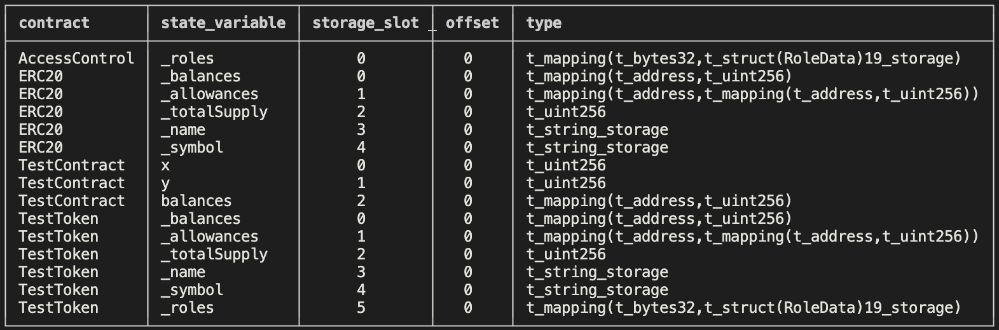

# Evm Slot Key Verification
The repo provides the functionality to compute the key of an Ethereum storage slot in Cairo. 

The Ethereum storage verifier [Fossil](https://github.com/OilerNetwork/fossil) allows one to verify any part of the Ethereum state on StarkNet. This enables a wide range of functionality including the on-chain voting protocol Snapshot X. It works by users submitting a proof to StarkNet of the contents of a specific storage slot on Ethereum that they require, and then that proof gets verified in a Cairo contract. However there is no mechanism to check that the slot the user submitted a proof of actually corresponds to the slot claimed. 

This repo provides a function to compute the key of a storage slot, which can then be compared against the key submitted as part of the proof. If the keys do not match then the contract will know that the proof is invalid.


### Finding the Slot Index

The storage layout hardhat plugin can be used to find the index for the desired slot. Either add the plugin to your repo or clone this repo, add your cotract source code, and run `yarn storage-layout`. The slot index is found from the `storage_slot` column of the output table:




### Finding the slot key in Cairo

Once you know the index of the slot, you can then call the `get_slot_key` cairo function with the slot index and the solidity mapping key as arguments (eg for finding the key of `balances[_address]`, the mapping key would be `_address`). The interface of `get_slot_key' is as shown:
```
func get_slot_key{bitwise_ptr : BitwiseBuiltin*, range_check_ptr}(slot_index: felt, mapping_key: felt) -> (slot_key : Uint256):
end 
```

NOTE: This only works for solidity mappings with value types currently 
